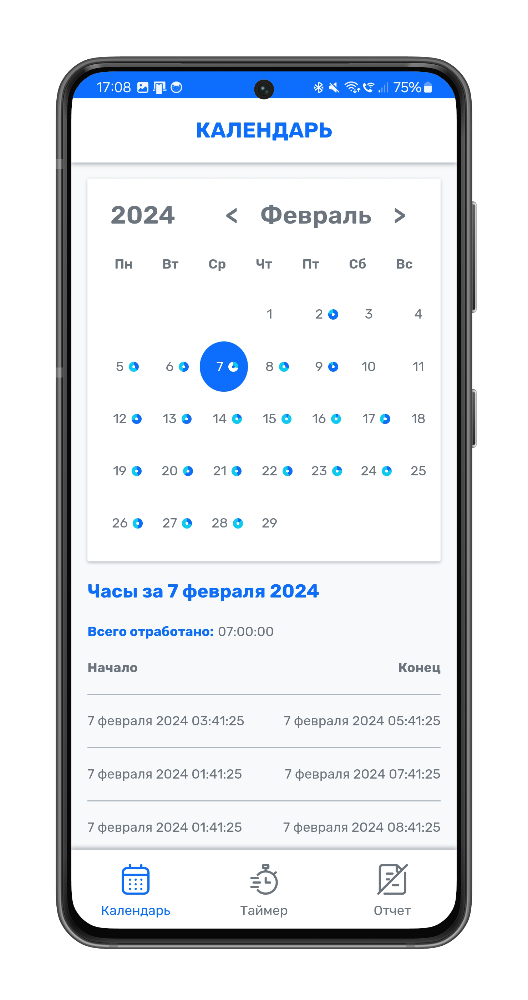
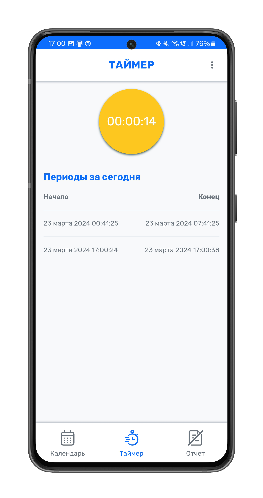
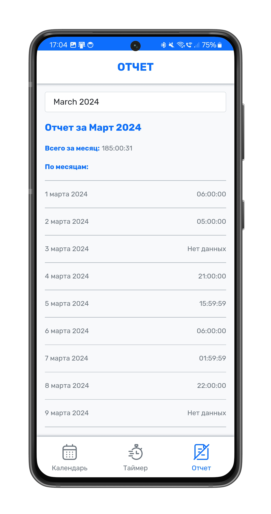

# Work Timer

Этот проект представляет собой приложение для учета и контроля рабочего времени, разработанное с использованием .NET
API, Blazor и MAUI.

<p float="left">
  
  
  
</p>

## Описание

Приложение предназначено для учета времени, проведенного на работе. Оно предоставляет удобный интерфейс для отслеживания
времени работы, а также генерации отчетов и анализа производительности.

## Основные особенности

- **Учет времени**: Возможность фиксировать время начала и окончания работы над проектами.
- **Генерация отчетов**: Создание отчетов о затраченном времени.
- **Анализ производительности**: Просмотр и анализ эффективности работы в разрезе времени.
- **Кроссплатформенность**: Поддержка мобильных устройств через Blazor и MAUI.

## Технологии

- **.NET API**: Используется для бэкенд логики и управления данными.
- **Blazor**: Для разработки веб-интерфейса приложения.
- **MAUI**: Для создания мобильной версии приложения с поддержкой Android.

## Установка и запуск

### Перед началом

1. Скачайте и установите [Docker](https://www.docker.com/).
2. Установите систему контроля версий [Git](https://git-scm.com/).
3. Склонируйте репозиторий проекта.
    ```shell
   git clone https://github.com/MJSasha/work-timer.git
    ```
   
### Запуск бекенда и фронтенда

1. Перейдите в папку проекта.
2. Выполните команду.
    ```shell
    docker compose up -d
    ```
   
После этого приложение будет доступно по адресу http://localhost:5016. А сервер на порту 8080.

### Сборка мобильного приложения

1. Перейдите в `src/WorkTimer.App/MauiProgram.cs`.
2. Установите `ApiUri` в значение, соответствующее адресу бекенда.
3. Выполните сборку проекта `WorkTimer.App -> Publish`.
4. Перенесите файл публикации на мобильные устройства и установите приложение.

## Лицензия

Этот проект распространяется под лицензией MIT. Подробности смотрите в файле [LICENSE](LICENSE).